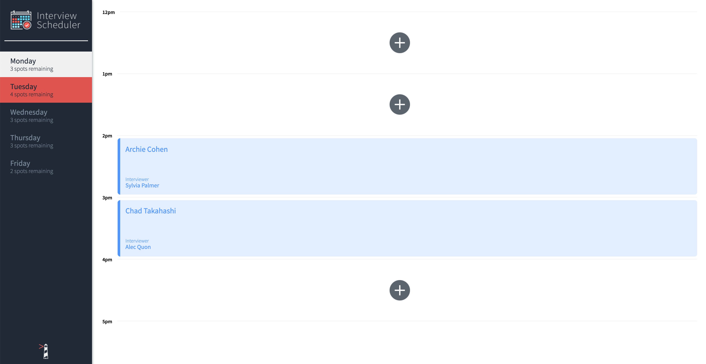

# Interview Scheduler

## Description
Interview Scheduler is a Single Page Application (SPA) built using React. It allows users to book and cancel interviews. Data is persisted by API server using a PostgreSQL database.

## Setup

Install dependencies with `npm install`.

## Running Webpack Development Server

```sh
npm start
```

## Running Jest Test Framework

```sh
npm test
```

## Running Storybook Visual Testbed

```sh
npm run storybook
```
## Features
- Display appointment days from Monday to Friday. Users can switch between weekdays.


## Tech Stack
React
Axios
HTML
SASS
Javascript
Express
Node.js
PostgreSQL
Storybook
Webpack Dev Server
Jest
Testing library
Cypress
