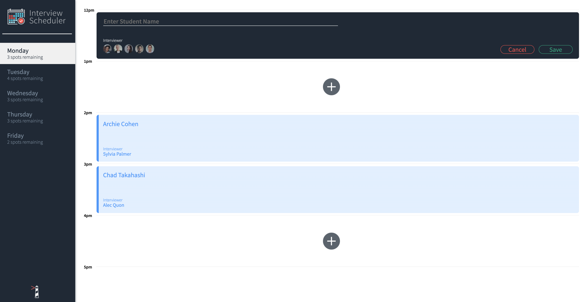

# Interview Scheduler

## Description
Interview Scheduler is a Single Page Application (SPA) built using React. It allows users to book and cancel interviews. Data is persisted by API server using a PostgreSQL database.

## Setup

Install dependencies with `npm install`.

## Running Webpack Development Server

```sh
npm start
```

## Running Jest Test Framework

```sh
npm test
```

## Running Storybook Visual Testbed

```sh
npm run storybook
```
## Features
- Display appointment days from Monday to Friday. Users can switch between weekdays. 
- The list of days informs the user how many slots are available for each day.


- User can edit details of an existing interview.


- User can cancel an existing interview.
- User is presented with a confirmation when they attempt to cancel an interview.


- User can book an interview in an empty appointment slot.


- User is shown an error if an interview cannot be saved or deleted.


## Tech Stack
- React
- Axios
- HTML
- SASS
- Javascript
- Express
- Node.js
- PostgreSQL
- Storybook
- Webpack Dev Server
- Jest
- Testing library
- Cypress
